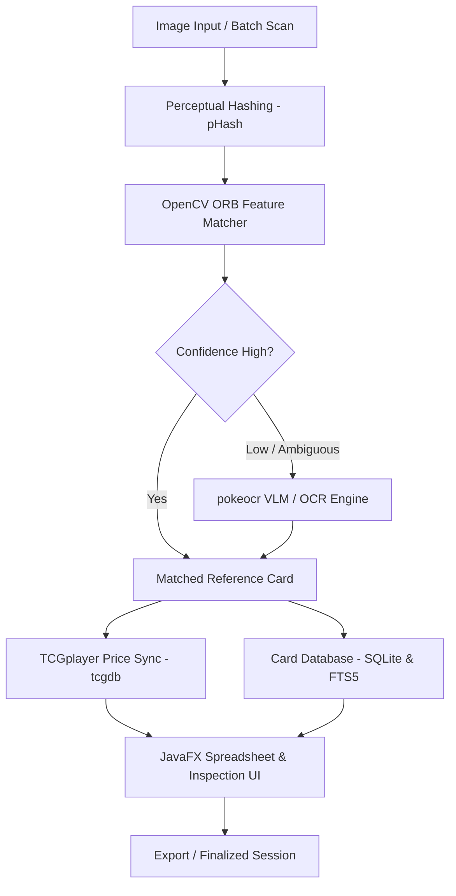

# pokecard

[](https://openjdk.org/projects/jdk/21/)
[](https://openjfx.io/)
[](https://opencv.org/)
[](https://maven.apache.org/)

**pokecard** is an automated Pokémon Trading Card Game (TCG) identification, visual comparison, cataloging, and market valuation platform. It combines computer vision, perceptual hashing, deep learning OCR/VLMs, and TCGplayer pricing feeds into a unified desktop application built with JavaFX.
I designed this software with the main goal of selling a large part of my collection, since having to manually check each card's value would take tens of hours.

---

## Key Features

- **Multi-Stage Card Recognition Pipeline**:
  - **hashing**: Used as weedout for duplicate card identification.
  - **Traditional Feature-Based Matching (OpenCV ORB & Homography)**: Rotation, perspective, and scale-invariant descriptor matching using ORB features, Brute-Force Hamming matching, and RANSAC homography to identify cards even from skewed camera scans. works in about 85-90% of cases.
  - **Deep OCR & Vision-Language Models (pokeocr)**: Subprocess-managed Python neural pipeline supporting multiple OCR and VLM backends:
    - EasyOCR
    - GOT-OCR 2.0
    - TrOCR
    - Qwen2.5-VL (recommended)
    - Automatic card orientation detection (0°, 90°, 180°, 270°) and segmented band transcription (`TOP`, `MIDDLE`, `BOTTOM`) to parse card name, HP, set numbers, and abilities.
- **Automated Python Environment Management**:
  - I use process builder to automatically resolve all dependencies for the python subprocesses, and JGit for cloning the pokemon card database.
- **TCGplayer Market Pricing Integration (`tcgdb`)**:
  - Background synchronization with TCGCSV to mirror current market prices, direct low prices, and price history into local SQLite storage.
  - Supports card variants: Normal, Holofoil, Reverse Holofoil, 1st Edition, and unlimited variants.
- **Fast Search & Database Browsing (`CardSearchRepo`)**:
  - Indexed SQLite catalog with SQLite FTS5 full-text search and BM25 ranking for instant manual lookups and candidate overrides in the case that the program is wrong.

---

## Architecture Overview (curtsy of claude)



## Prerequisites

- **Java Development Kit (JDK)**: Java 21 or newer.
- **Apache Maven**: Version 3.8+ for building and dependency management.
- **Python**: Version 3.9+ installed and available on system `PATH`.
- **Disk Space**: ~4GB recommended for database and reference card image set, 10GBs for the pytorch resources if you want to use ml.
- **Note: if you don't want to build the project, you can download the prebuilt jar from the releases page. This way, you only need python installed.**

---

## Getting Started

### 1. Clone the Repository

```bash
git clone https://github.com/willtryon/pokecard.git
cd pokecard
```

### 2. Build the Project

```bash
cd pokecard
mvn clean package
```

### 3. Running the Application

You can launch the JavaFX application directly using the JavaFX Maven plugin:

```bash
cd pokecard
mvn javafx:run
```

Or run the shaded fat JAR generated in `pokecard/target/`:

```bash
java -jar pokecard/target/pokecard-x.x.x.jar
```

## License & Disclaimer

- The source code in this repository is authored by [willtryon](https://github.com/willtryon).
- Pokémon and Pokémon character names and images are trademarks and copyright of Nintendo, Creatures Inc., GAME FREAK inc., and The Pokémon Company. This software is an unofficial community project and is not affiliated with or endorsed by Nintendo or The Pokémon Company.
